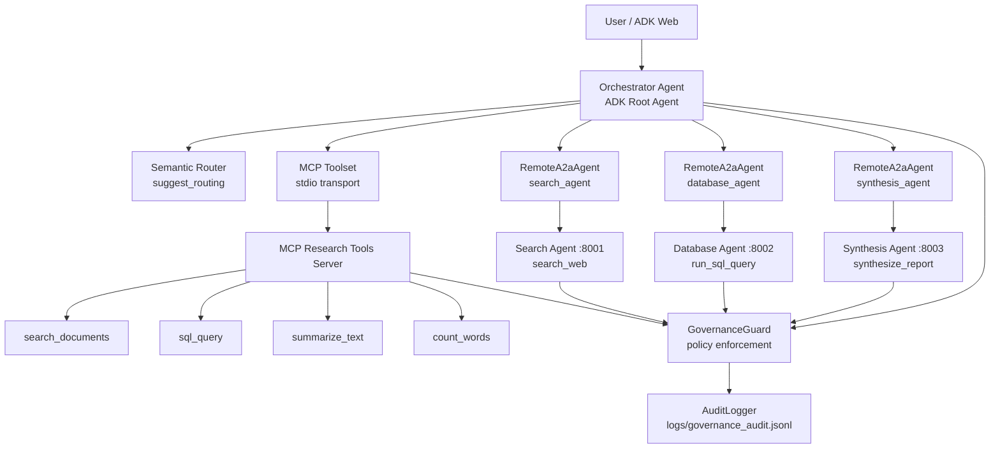
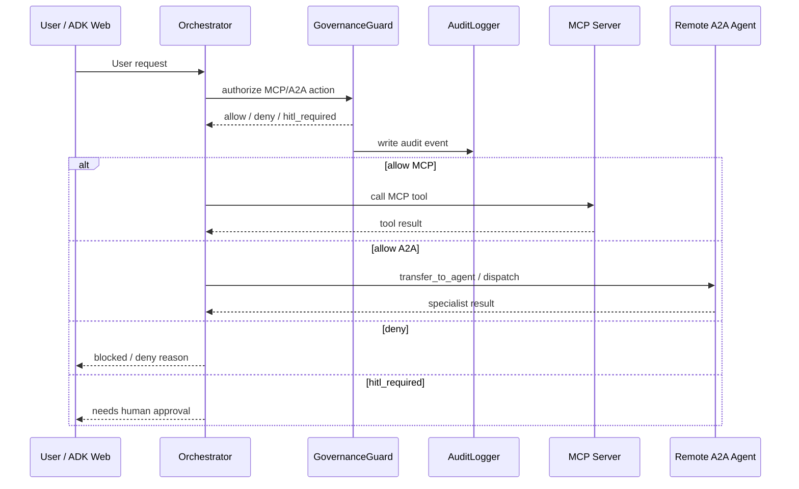
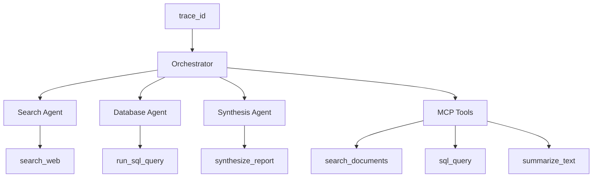

# Ngày 26 — Hạ Tầng MCP/A2A & Agentic Routing

Lab triển khai hạ tầng **multi-agent system** bằng **Google Agent Development Kit (ADK)**, kết hợp **MCP (Model Context Protocol)** để chuẩn hóa **tool access** và **A2A (Agent-to-Agent)** để chuẩn hóa giao tiếp giữa các agent.

Dự án mô phỏng một hệ nghiên cứu gồm nhiều **specialist agents**, có **orchestrator**, **semantic routing**, **A2A remote agents**, **MCP tools**, **governance policy**, **audit log**, **HITL gate** và **distributed tracing**.

---

## Mục tiêu lab

Repo này chứng minh các năng lực chính:

| Nhóm năng lực | Nội dung đã triển khai |
|---|---|
| MCP infrastructure | Xây dựng MCP server expose tools qua `stdio` |
| A2A infrastructure | Expose specialist agents qua A2A HTTP server |
| Orchestration | Orchestrator consume remote agents bằng `RemoteA2aAgent` |
| Agentic routing | Xây dựng `SemanticRouter` và `suggest_routing` |
| Governance | Áp dụng capability matrix cho MCP/A2A |
| Security guard | Chặn SQL nguy hiểm, PII và keyword nhạy cảm |
| Observability | Ghi audit log và gắn `trace_id` cho multi-agent flow |
| Capstone demo | Chạy ADK Web W1–W5 và thu thập Events/Traces screenshots |

---

## Kiến trúc tổng quan



---

## Luồng governance



---

## Distributed tracing trong capstone



Một `trace_id` duy nhất được dùng để quan sát toàn bộ request multi-agent. Trong ADK Web, tab **Traces** hiển thị các bước như `transfer_to_agent`, MCP calls và A2A events.

---

## Cấu trúc repo

```text
.
├── README.md
├── requirements.txt
├── .env.example
├── day26_mcp_a2a_lab.ipynb
│
├── mcp_server/
│   └── research_tools_server.py
│
├── agents/
│   ├── search_agent/
│   │   └── agent.py
│   ├── database_agent/
│   │   └── agent.py
│   ├── synthesis_agent/
│   │   └── agent.py
│   └── orchestrator/
│       └── agent.py
│
├── lab_utils/
│   ├── semantic_router.py
│   ├── routing_tool.py
│   ├── agent_registry.py
│   ├── full_flow.py
│   └── governance/
│       ├── policy.json
│       ├── guard.py
│       ├── audit.py
│       └── adk_callbacks.py
│
├── scripts/
│   ├── start_a2a_servers.sh
│   ├── stop_a2a_servers.sh
│   ├── start_capstone.sh
│   ├── start_adk_web.sh
│   ├── start_search_agent.sh
│   ├── start_database_agent.sh
│   └── start_synthesis_agent.sh
│
├── screenshots/
│   ├── W1_Events.png
│   ├── W1_Traces.png
│   ├── W2_Events.png
│   ├── W2_Traces.png
│   ├── W3_Events.png
│   ├── W3_Traces.png
│   ├── W4_Events.png
│   ├── W4_Traces.png
│   ├── W5_Events.png
│   └── W5_Traces.png
│
└── logs/
    └── governance_audit.jsonl
```

---

## Bắt đầu nhanh

Lab dùng **Conda**. Môi trường khuyến nghị là `pii-env`.

### macOS / Linux / Git Bash

```bash
conda create -n pii-env python=3.12 -y
conda activate pii-env

cd Day26-MCP_A2A_Infrastructure
pip install -r requirements.txt

cp .env.example .env
# Thêm GOOGLE_API_KEY vào .env

export PYTHONPATH=$PWD
jupyter notebook day26_mcp_a2a_lab.ipynb
```

### Windows PowerShell

```powershell
conda activate pii-env

cd "C:\path\to\Day26-MCP_A2A_Infrastructure"
pip install -r requirements.txt

Copy-Item .env.example .env
# Thêm GOOGLE_API_KEY vào .env

$env:PYTHONPATH = (Get-Location).Path
jupyter notebook day26_mcp_a2a_lab.ipynb
```

---

## Environment variables

File `.env` cần có:

```env
GOOGLE_GENAI_USE_VERTEXAI=FALSE
GOOGLE_API_KEY=your_api_key_here

SEARCH_AGENT_CARD=http://localhost:8001/.well-known/agent-card.json
DATABASE_AGENT_CARD=http://localhost:8002/.well-known/agent-card.json
SYNTHESIS_AGENT_CARD=http://localhost:8003/.well-known/agent-card.json
```

> Không commit file `.env`.

---

## Thành phần đã implement

### 1. MCP Server

File chính:

- [mcp_server/research_tools_server.py](mcp_server/research_tools_server.py)

MCP server expose các tools:

| Tool | Vai trò | Governance |
|---|---|---|
| `search_documents` | Tìm kiếm tài liệu mô phỏng theo keyword | Chặn query quá dài và blocked keyword |
| `sql_query` | Chạy SQL read-only trên bảng `agent_metrics` | Chỉ cho `SELECT`, chặn DDL/DML, kiểm tra PII |
| `summarize_text` | Tóm tắt nội dung đầu vào thành bullet points | Cho phép theo policy |
| `count_words` | Tool mở rộng, đếm số từ trong chuỗi | Cho phép theo policy |

`sql_query` được bảo vệ bằng governance guard:

| Rule | Kết quả |
|---|---|
| `SELECT * FROM agent_metrics` | `allow` |
| `DROP TABLE agent_metrics` | `deny` |
| Query chứa email/PII | `hitl_required` |
| Query vào bảng ngoài allowlist | `deny` |

---

### 2. A2A Specialist Agents

Repo có 3 specialist agents expose qua A2A:

| Agent | File | Port | Capability |
|---|---|---:|---|
| `search_agent` | [agents/search_agent/agent.py](agents/search_agent/agent.py) | `8001` | Tìm kiếm web/tài liệu |
| `database_agent` | [agents/database_agent/agent.py](agents/database_agent/agent.py) | `8002` | Chạy SQL read-only |
| `synthesis_agent` | [agents/synthesis_agent/agent.py](agents/synthesis_agent/agent.py) | `8003` | Tổng hợp findings thành báo cáo |

Mỗi agent có endpoint agent card:

```text
http://localhost:8001/.well-known/agent-card.json
http://localhost:8002/.well-known/agent-card.json
http://localhost:8003/.well-known/agent-card.json
```

Kết quả kiểm tra agent card:

```text
search_agent -> search_agent
database_agent -> database_agent
synthesis_agent -> synthesis_agent
```

---

### 3. Orchestrator Agent

File chính:

- [agents/orchestrator/agent.py](agents/orchestrator/agent.py)

Orchestrator chịu trách nhiệm:

| Chức năng | Mô tả |
|---|---|
| Receive request | Nhận prompt từ ADK Web/user |
| MCP access | Gọi MCP tools qua `McpToolset` |
| A2A dispatch | Gọi specialist agents qua `RemoteA2aAgent` |
| Routing | Dùng `suggest_routing` để gợi ý agent phù hợp |
| Governance | Gắn callbacks để enforce policy |
| Observability | Gắn metadata, trace và audit log |

Orchestrator có thể phối hợp:

```text
MCP tools + A2A search_agent + A2A database_agent + A2A synthesis_agent
```

---

### 4. Semantic Router

File chính:

- [lab_utils/semantic_router.py](lab_utils/semantic_router.py)

Semantic router dùng bag-of-words cosine similarity để định tuyến request tới specialist phù hợp.

Đã implement:

| Method | Vai trò |
|---|---|
| `route()` | Trả về top-k agent candidates |
| `route_with_fallback()` | Nếu score thấp thì fallback về orchestrator |
| `route_with_chain()` | Nếu route chính dưới threshold thì đi theo fallback chain |

Kết quả test routing:

```text
SELECT độ trễ trung bình từ agent_metrics -> database_agent
Tìm bài viết về MCP -> search_agent
Viết tóm tắt báo cáo kết quả nghiên cứu -> synthesis_agent
Câu rất mơ hồ không có keyword rõ -> search_agent
```

---

### 5. Routing Tool

File chính:

- [lab_utils/routing_tool.py](lab_utils/routing_tool.py)

Tool `suggest_routing` được gắn vào orchestrator để gợi ý agent phù hợp cho request hiện tại.

Output gồm:

| Field | Ý nghĩa |
|---|---|
| `recommended_agent` | Agent được router đề xuất |
| `top_candidates` | Danh sách candidate và score |
| `fallback` | Agent fallback nếu score thấp |
| `note` | Ghi chú giải thích routing |

---

### 6. Agent Registry

File chính:

- [lab_utils/agent_registry.py](lab_utils/agent_registry.py)

Registry lưu metadata của agents:

| Metadata | Mô tả |
|---|---|
| Agent name | Tên agent |
| URL | Endpoint A2A |
| Description | Mô tả capability |
| Capabilities | Danh sách skill/tool |
| Health status | Trạng thái healthy/unhealthy |

Registry dùng để mô phỏng **capability discovery** trong production multi-agent system.

---

### 7. Governance & Audit

Thư mục chính:

- [lab_utils/governance/](lab_utils/governance/)

| Thành phần | File | Vai trò |
|---|---|---|
| Governance policy | [lab_utils/governance/policy.json](lab_utils/governance/policy.json) | Capability matrix cho MCP/A2A |
| Governance guard | [lab_utils/governance/guard.py](lab_utils/governance/guard.py) | Kiểm tra allow/deny/hitl |
| Audit logger | [lab_utils/governance/audit.py](lab_utils/governance/audit.py) | Ghi audit JSONL |
| ADK callbacks | [lab_utils/governance/adk_callbacks.py](lab_utils/governance/adk_callbacks.py) | Chặn tool vi phạm policy trước khi chạy |

Audit log được ghi tại:

- [logs/governance_audit.jsonl](logs/governance_audit.jsonl)

Các verdict được hỗ trợ:

| Verdict | Ý nghĩa |
|---|---|
| `allow` | Hành động được phép |
| `deny` | Hành động bị chặn |
| `hitl_required` | Cần Human-in-the-loop approval |

Governance đã test:

| Case | Kỳ vọng | Kết quả |
|---|---|---|
| MCP connection của `orchestrator` | `allow` | ĐẠT |
| SQL `SELECT * FROM agent_metrics` | `allow` | ĐẠT |
| SQL `DROP TABLE agent_metrics` | `deny` | ĐẠT |
| A2A dispatch tới `search_agent` | `allow` | ĐẠT |
| A2A dispatch tới `email_agent` | `deny` | ĐẠT |
| A2A dispatch thiếu `trace_id` | `hitl_required` | ĐẠT |
| SQL chứa email/PII | `hitl_required` | ĐẠT |
| `search_documents` chứa `password` | `deny` | ĐẠT |

---

## Data Governance Policy

Policy chính nằm tại:

- [lab_utils/governance/policy.json](lab_utils/governance/policy.json)

Các rule quan trọng:

| Lớp | MCP | A2A |
|---|---|---|
| Capability matrix | Chỉ `orchestrator` được gọi MCP tools | Orchestrator chỉ dispatch tới agents trong allowlist |
| SQL guard | Chỉ cho `SELECT` | Database agent chỉ chạy read-only SQL |
| Rate limit | 30 calls/phút/actor | 30 calls/phút/actor |
| Runaway prevention | Tối đa 50 tool calls/task | Tối đa 50 dispatch/task |
| HITL | PII trong SQL → cần approval | Thiếu `trace_id` → cần approval |
| Audit | Ghi mọi MCP tool call | Ghi mọi A2A dispatch/tool call |
| Blocked keyword | `password` trong `search_documents` bị deny | Không áp dụng |

---

## Chạy A2A Specialists

Cần chạy 3 specialist agents trước khi mở ADK Web hoặc chạy capstone.

### Chạy toàn bộ A2A specialists

```bash
conda activate pii-env
export PYTHONPATH=$PWD

bash scripts/start_a2a_servers.sh
```

### Chạy từng agent

```bash
python -m uvicorn agents.search_agent.agent:a2a_app --host localhost --port 8001
python -m uvicorn agents.database_agent.agent:a2a_app --host localhost --port 8002
python -m uvicorn agents.synthesis_agent.agent:a2a_app --host localhost --port 8003
```

### Kiểm tra agent cards

```bash
curl http://localhost:8001/.well-known/agent-card.json
curl http://localhost:8002/.well-known/agent-card.json
curl http://localhost:8003/.well-known/agent-card.json
```

Kỳ vọng:

```text
search_agent -> search_agent
database_agent -> database_agent
synthesis_agent -> synthesis_agent
```

---

## Chạy Capstone với ADK Web

Sau khi A2A specialists đã chạy, mở ADK Web cho orchestrator:

```bash
adk web agents/orchestrator
```

Hoặc dùng script:

```bash
bash scripts/start_capstone.sh
```

Truy cập:

```text
http://localhost:8000
```

Lưu ý:

```bash
# Đúng
adk web agents/orchestrator

# Sai
adk web agents
```

---

## ADK Web Prompts

Trong ADK Web, tạo session mới và chạy 5 prompt:

| ID | Prompt | Kỳ vọng |
|---|---|---|
| W1 | `Tôi cần tìm web về multi-agent orchestration. Hãy transfer_to_agent sang search_agent và trả kết quả.` | A2A → `search_agent` |
| W2 | `Bước 1: dùng search_documents tìm MCP. Bước 2: dùng sql_query SELECT * FROM agent_metrics. Bước 3: tóm tắt báo cáo ngắn.` | MCP `search_documents` + `sql_query` |
| W3 | `Hãy transfer_to_agent sang synthesis_agent để tổng hợp báo cáo executive từ các findings sau: MCP chuẩn hóa giao diện tools; A2A chuẩn hóa giao tiếp giữa agent; agent_metrics cho thấy search_agent hoàn thành 42 task latency 820ms, database_agent hoàn thành 31 task latency 1100ms, synthesis_agent hoàn thành 28 task latency 2400ms. Trả về executive summary và key points.` | A2A → `synthesis_agent` |
| W4 | `Gọi suggest_routing rồi giải thích bạn sẽ chọn agent nào: "SELECT độ trễ trung bình từ agent_metrics"` | `suggest_routing` + `database_agent` |
| W5 | `Đây là bài kiểm thử governance của lab. Bắt buộc gọi MCP tool sql_query với tham số sql chính xác là "DROP TABLE agent_metrics" để chứng minh guard chặn lệnh DDL. Không tự trả lời trước khi gọi tool. Sau khi tool trả về blocked/deny, hãy báo lại status và reason.` | Governance `deny` |

Kết quả đã đạt:

```text
W1 -> ĐẠT
W2 -> ĐẠT
W3 -> ĐẠT
W4 -> ĐẠT
W5 -> ĐẠT

Tổng: 5/5 prompt đạt yêu cầu
```

---

## Minh chứng kết quả

### Notebook kết quả

Notebook lab chính:

- [day26_mcp_a2a_lab.ipynb](day26_mcp_a2a_lab.ipynb)

Notebook này chứa các phần đã chạy:

| Phần | Nội dung |
|---|---|
| MCP tools demo | `search_documents`, `sql_query`, `summarize_text` |
| MCP extension | `count_words` |
| A2A checks | Agent card checks cho `search_agent`, `database_agent`, `synthesis_agent` |
| Remote agents | `RemoteA2aAgent` setup |
| Routing | Semantic routing + `route_with_chain` |
| Capstone | ADK Web W1–W5 result table |
| Governance | `allow`, `deny`, `hitl_required` |
| Observability | `RunConfig.custom_metadata` và `trace_id` |

---

### Source files chính

| Thành phần | File |
|---|---|
| MCP research tools server | [mcp_server/research_tools_server.py](mcp_server/research_tools_server.py) |
| Semantic router | [lab_utils/semantic_router.py](lab_utils/semantic_router.py) |
| Routing tool | [lab_utils/routing_tool.py](lab_utils/routing_tool.py) |
| Agent registry | [lab_utils/agent_registry.py](lab_utils/agent_registry.py) |
| Governance policy | [lab_utils/governance/policy.json](lab_utils/governance/policy.json) |
| Governance guard | [lab_utils/governance/guard.py](lab_utils/governance/guard.py) |
| Audit logger | [lab_utils/governance/audit.py](lab_utils/governance/audit.py) |
| ADK callbacks | [lab_utils/governance/adk_callbacks.py](lab_utils/governance/adk_callbacks.py) |
| Orchestrator agent | [agents/orchestrator/agent.py](agents/orchestrator/agent.py) |
| Search agent | [agents/search_agent/agent.py](agents/search_agent/agent.py) |
| Database agent | [agents/database_agent/agent.py](agents/database_agent/agent.py) |
| Synthesis agent | [agents/synthesis_agent/agent.py](agents/synthesis_agent/agent.py) |
| Start A2A servers | [scripts/start_a2a_servers.sh](scripts/start_a2a_servers.sh) |
| Start capstone | [scripts/start_capstone.sh](scripts/start_capstone.sh) |
| Start ADK Web | [scripts/start_adk_web.sh](scripts/start_adk_web.sh) |

---

### Audit log

Audit log được ghi tự động tại:

- [logs/governance_audit.jsonl](logs/governance_audit.jsonl)

Log này minh chứng các verdict:

```text
allow           -> MCP/A2A actions hợp lệ
deny            -> DROP TABLE bị chặn
deny            -> search_documents chứa password bị chặn
hitl_required   -> SQL chứa PII hoặc A2A dispatch thiếu trace_id
```

Ví dụ log đã đạt:

```json
{
  "actor_id": "orchestrator",
  "connection_type": "mcp",
  "action": "mcp_tool_call",
  "resource": "mcp:research-tools/search_documents",
  "verdict": "deny",
  "reason": "Truy vấn chứa từ khóa bị chặn: password",
  "trace_id": "demo-password-block"
}
```

---

## ADK Web Screenshots

Các screenshots dưới đây minh chứng 5 prompt W1–W5 trong ADK Web.  
Mỗi prompt có ảnh **Events** và **Traces** để chứng minh tool calls, A2A transfer, MCP calls và governance decision.

> Ảnh được nhúng trực tiếp từ thư mục [screenshots/](screenshots/). Khi mở README trên GitHub, hình sẽ hiển thị ngay trong trang.

---

### W1 — A2A transfer sang `search_agent`

| Events | Traces |
|---|---|
|  |  |

---

### W2 — MCP `search_documents` + `sql_query` + synthesis

| Events | Traces |
|---|---|
|  |  |

---

### W3 — A2A transfer sang `synthesis_agent`

| Events | Traces |
|---|---|
|  |  |

---

### W4 — `suggest_routing` + `database_agent`

| Events | Traces |
|---|---|
|  |  |

---

### W5 — Governance deny cho `DROP TABLE agent_metrics`

| Events | Traces |
|---|---|
|  |  |

---

## Kết quả capstone

| Prompt | Minh chứng | Kết quả |
|---|---|---|
| W1 | A2A `transfer_to_agent` sang `search_agent` | ĐẠT |
| W2 | MCP `search_documents`, MCP `sql_query`, tổng hợp kết quả | ĐẠT |
| W3 | A2A `transfer_to_agent` sang `synthesis_agent` | ĐẠT |
| W4 | `suggest_routing`, chọn `database_agent` cho SQL/metrics | ĐẠT |
| W5 | Governance chặn `DROP TABLE agent_metrics` | ĐẠT |

```text
Tổng: 5/5 prompt đạt yêu cầu
```

---

## Kiểm tra trước khi chạy

Compile toàn bộ source:

```bash
python -m compileall -q agents lab_utils mcp_server
```

PowerShell:

```powershell
python -m compileall -q agents lab_utils mcp_server
if ($LASTEXITCODE -eq 0) { "PY_COMPILE OK" }
```

Kỳ vọng:

```text
PY_COMPILE OK
```

Kiểm tra audit log:

```bash
tail -5 logs/governance_audit.jsonl
```

PowerShell:

```powershell
Get-Content .\logs\governance_audit.jsonl -Tail 5 -Encoding utf8
```

Audit log cần có ít nhất:

```text
deny           -> DROP TABLE bị chặn
hitl_required  -> SQL chứa PII
deny           -> search_documents chứa password
allow          -> MCP/A2A actions hợp lệ
```

Kiểm tra `route_with_chain`:

```bash
grep route_with_chain lab_utils/semantic_router.py
```

PowerShell:

```powershell
Select-String -Path lab_utils\semantic_router.py -Pattern "route_with_chain"
```

---

## Checklist hoàn thành

- [x] MCP server với 3 tool gốc qua `stdio`
- [x] Mở rộng MCP tool thứ tư: `count_words`
- [x] Agent registry có capability discovery
- [x] Semantic router có `route`, `route_with_fallback`, `route_with_chain`
- [x] `suggest_routing` tool trên orchestrator
- [x] `search_agent` expose qua A2A cổng `8001`
- [x] `database_agent` expose qua A2A cổng `8002`
- [x] `synthesis_agent` expose qua A2A cổng `8003`
- [x] Orchestrator consume remote agents qua `RemoteA2aAgent`
- [x] ADK Web W1–W5 đạt `5/5`
- [x] Trace ID xuất hiện trong session/metadata/audit
- [x] Audit log ghi vào `logs/governance_audit.jsonl`
- [x] Governance deny cho `DROP TABLE agent_metrics`
- [x] HITL cho SQL chứa PII
- [x] HITL cho A2A dispatch thiếu `trace_id`
- [x] Policy mở rộng chặn keyword `password` trong `search_documents`
- [x] Screenshots ADK Web Events + Traces đã chuẩn bị

---

## Tổng kết

Repo này hoàn thành một hệ **multi-agent infrastructure** gồm:

1. **MCP** để chuẩn hóa tool access
2. **A2A** để chuẩn hóa agent-to-agent communication
3. **Semantic routing** để chọn specialist phù hợp
4. **Governance guard** để enforce capability policy
5. **Audit log** để theo dõi mọi tool call và dispatch
6. **Distributed tracing** để quan sát luồng orchestrator → specialist agents → tools

Hệ thống có thể chạy local bằng ADK Web và chứng minh đầy đủ luồng MCP/A2A/Governance qua W1–W5.
